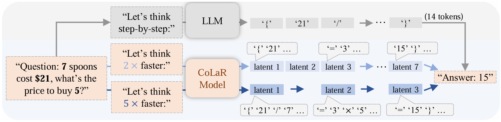
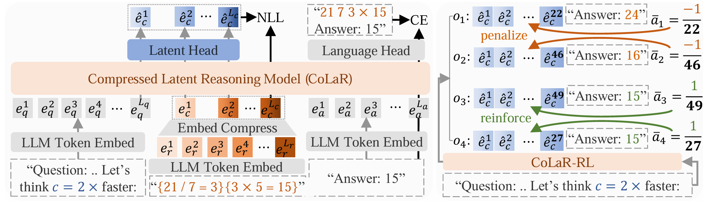
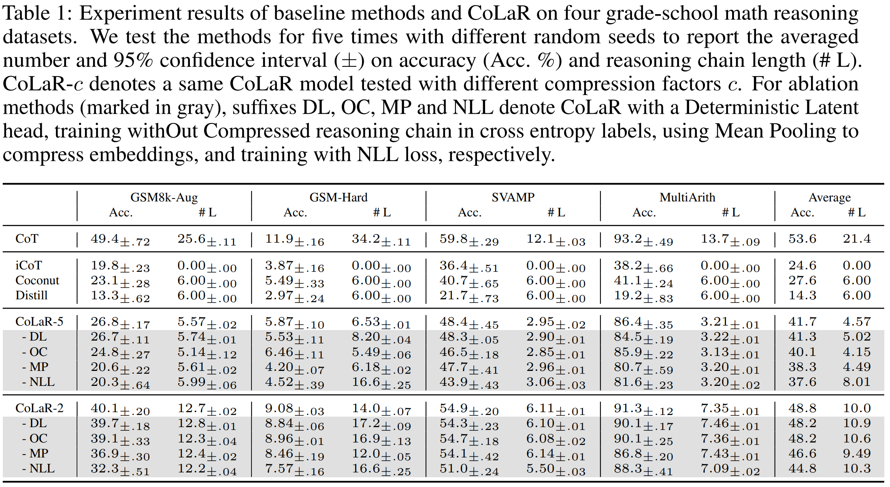
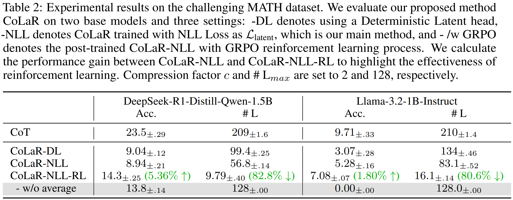

# Think Silently, Think Fast: Dynamic Latent Compression of LLM Reasoning Chains

### Wenhui Tan<sup>1</sup>, Jiaze Li<sup>2</sup>, Jianzhong Ju<sup>2</sup>, Zhenbo Luo<sup>2</sup>, Jian Luan<sup>2</sup>, Ruihua Song<sup>1</sup>

### Gaoling School of Artificial Intelligence, Renmin University of China<sup>1</sup>
### MiLM Plus, Xiaomi Inc.<sup>2</sup>

### [Paper](https://arxiv.org/pdf/2505.16552) | [Project Page](https://CoLaR-latent-reasoning.github.io) | [Models](https://huggingface.co/AlbertTan/CoLaR)



# Abstract:
Large Language Models (LLMs) achieve superior performance through Chain-of-Thought (CoT) reasoning, but these token-level reasoning chains are computationally expensive and inefficient. In this paper, we introduce Compressed Latent Reasoning (CoLaR), a novel framework that dynamically compresses reasoning processes in latent space through a two-stage training approach. First, during supervised fine-tuning, CoLaR extends beyond next-token prediction by incorporating an auxiliary next compressed embedding prediction objective. This process merges embeddings of consecutive tokens using a compression factor randomly sampled from a predefined range, and trains a specialized latent head to predict distributions of subsequent compressed embeddings. Second, we enhance CoLaR through reinforcement learning (RL) that leverages the latent head's non-deterministic nature to explore diverse reasoning paths and exploit more compact ones. This approach enables CoLaR to: i) perform reasoning at a dense latent level (i.e., silently), substantially reducing reasoning chain length, and ii) dynamically adjust reasoning speed at inference time by simply prompting the desired compression factor. Extensive experiments across four mathematical reasoning datasets demonstrate that CoLaR achieves 14.1% higher accuracy than latent-based baseline methods at comparable compression ratios, and reduces reasoning chain length by 53.3% with only 4.8% performance degradation compared to explicit CoT method. Moreover, when applied to more challenging mathematical reasoning tasks, our RL-enhanced CoLaR demonstrates performance gains of up to 5.4% while dramatically reducing latent reasoning chain length by 82.8%. The code and models will be released upon acceptance.



# Experiment results:




# Environment:
```
conda create -n colar python=3.10
conda activate colar
pip install -r requirements.txt
```
If that does not work, just instiall the second latest version of pytorch and transformers, and I believe it will work:) (We recommend a numpy version < 2.0)

# Training:
```
python run.py \
--devices=all \
--model=colar \
--dataset=qsa \
--do_test \
--load_ckpt_path=/path/to/pretrained/cot_model.ckpt \
--log_suffix=bs256_lr1e-4_and_so_on \
dataset_name=gsm \
model_id=Llama-3.2-1B-Instruct \
batch_size=256 \
max_compression_factor=5 \
compression_factor=5 \
max_new_tokens=16 \
max_epochs=50
```

# Evaluation:
```
python run.py \
--test_ckpt_path=/path/to/trained/model.ckpt
```

# Cite:
If you think this work is helpful to you, please cite our paper:
```
@article{tan2025colar,
  title={Think Silently, Think Fast: Dynamic Latent Compression of LLM Reasoning Chains},
  author={Tan, Wenhui and Li, Jiaze and Ju, Jianzhong and Luo, Zhenbo and Luan, Jian and Song, Ruihua},
  journal={arXiv preprint arXiv:2505.16552},
  year={2025}
}
```

# Something might help if you want to customize the project
## How to run an experiment:

### Experiments are combinations of models (architecture and training) and datasets

```
python run.py \
--model=the_file_name_without_.yaml_under_src/configs/models \# e.g., --model=toy_model
--dataset=the_file_name_without_.yaml_under_src/configs/datasets \# e.g., --dataset=toy_dataset
other_args
```

A config contains:
- A _target_ attribute that specifies the class to instantiate, e.g., src.models.toy_model.ToyModel.
- Some other attributes that are passed to the constructor of the class.

If there is not a _target_ attribute, the config can be treated as a dictionary, like dataloader.batch_size=128

## How to add a new model
- Add a new model class in src/models, e.g., src/models/my_model.py
- Add a new config in src/configs/models, e.g., src/configs/models/my_model.yaml

## You can set the hyper-parameters in commandline flexiblely
For example, under configs/models/colar.yaml, there is model.model_kwargs.lora_config.lora_alpha, which is set to 32 by default. If you want to run an experiment with the value set to 64, you can simply do:
```
python run.py --model=colar --dataset=qsa lora_alpha=64  # mind that there is no '--' before arguments for hyper-parameters
```

Which is equivalent to:
```
python run.py --model=colar --dataset=qsa model.model_kwargs.lora_config.lora_alpha=64
```

run.py will search the key in across the config and set **every matching key** to the value.

## Logs and checkpoints

### How to log
- values: in LightningModule, use self.log() self.log_dict() to log values like {'train/total_loss': loss}.
- texts: in ModelBase, we use self.text_logger.log('message') to log texts to log_dir/logs.txt.
- json: in ModelBase, we use self.json_logger.log({key: value}) to log json to log_dir/train.json or test.json.

### Where are the logs
Logs are saved under log_dir:`logs/{model_name}/{dataset_name}/datetime-random_number-customized_suffix`
You can customize the suffix by adding `--log_suffix=your_suffix` to the commandline, which helps you to distinguish different experiments.

### How to view the logs
- tensorboard: run `tensorboard --logdir=log_dir`
- In VSCode, simply run ctrl+shift+P and search "Launch TensorBoard" to nav to the log_dir and view the logs.

### How and where are the models checkpointed
How: Refer to src/configs/trainer/default.yaml.callbacks. We save the top-3 models on _monitor_ metric. For example, in val_step, do self.log_dict(['monitor': acc]) or self.log_dict(['monitor': -loss]) to log the metric you wan to monitor. The last checkpoint will be saved by default.

Where: Checkpoints are under log_dir/checkpoints

## Model evaluation
### Models are automatically tested after training if --do_test is set, e.g.:
```
python run.py --model=colar --dataset=qsa --do_test
```

### You can also run the test manually:
```
python run.py \
--test_ckpt_path=logs/model_name/dataset_name/log_dir/checkpoints/last.ckpt \
--model=the_file_name_without_.yaml_under_src/configs/models \# e.g., --model=colar
--dataset=the_file_name_without_.yaml_under_src/configs/datasets # e.g., --dataset=qsa
```

## Some tricks for a quick check
Run with tiny_dataset=True and --no_log, e.g.:
```
python run.py --model=colar --dataset=qsa --no_log tiny_dataset=True  # no log will be saved under logs, and only a tiny dataset will be loaded
```
